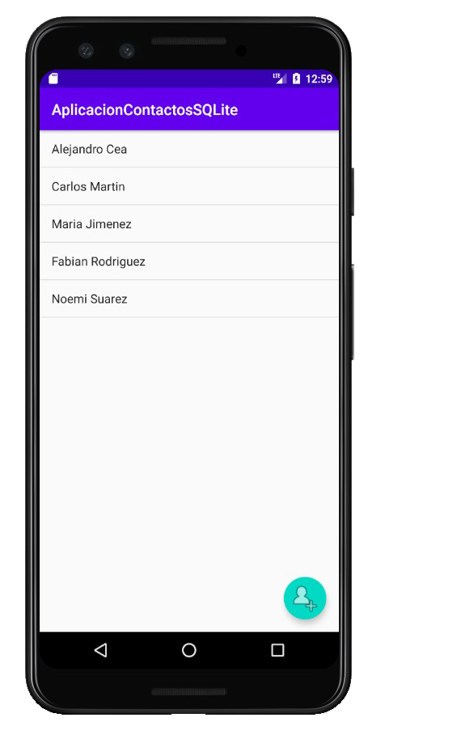
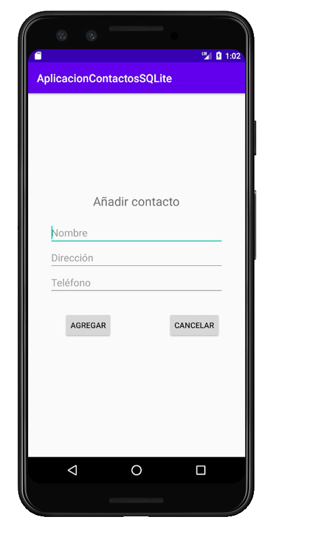
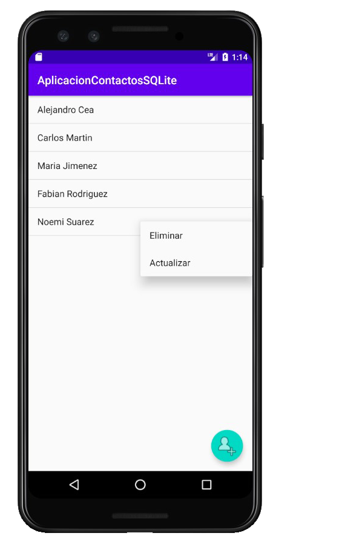
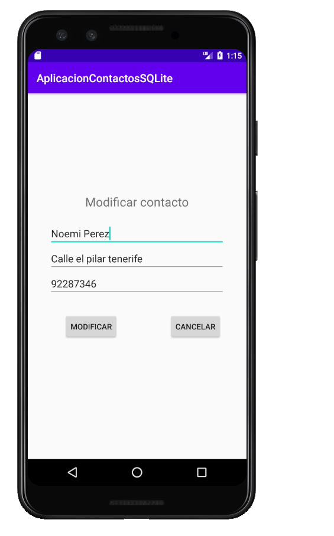
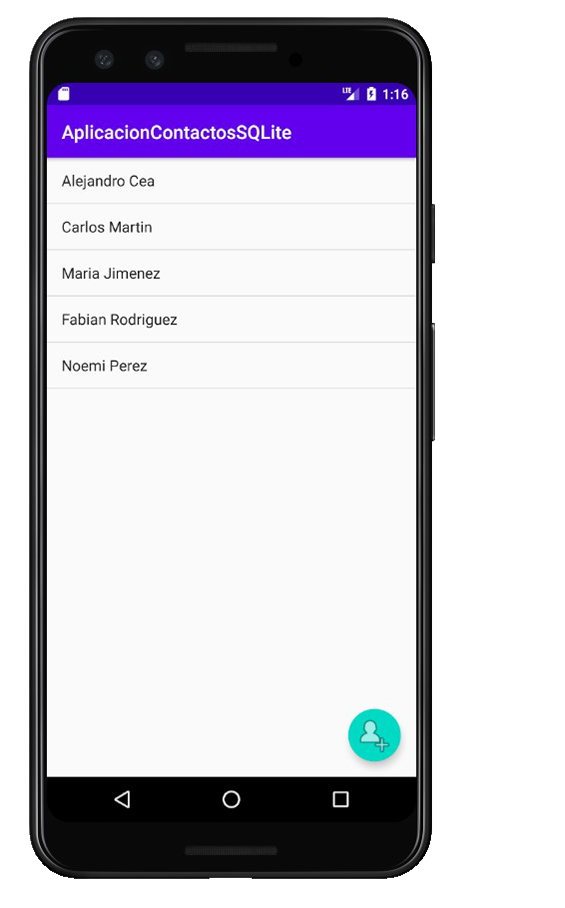
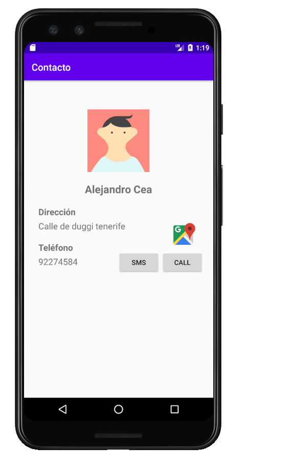
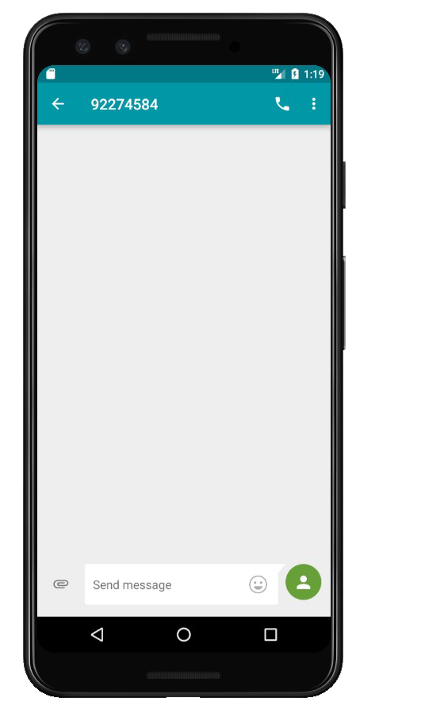
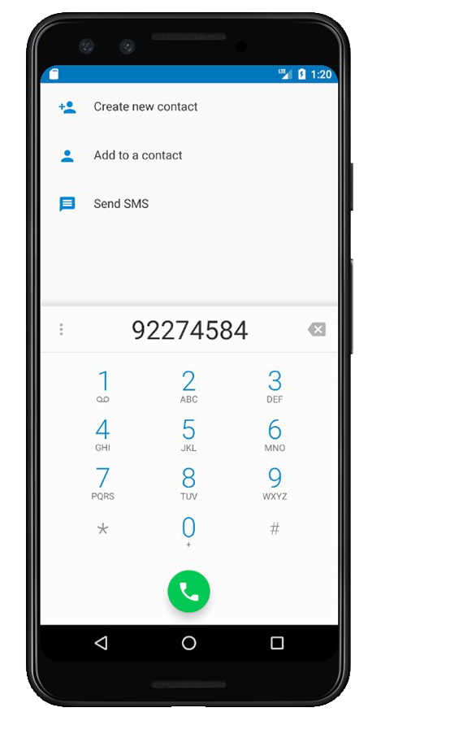

# Aplicación Contactos SQLite

## Descripción
Proyecto Android, realización de una aplicación de contactos telefónicos.
Características:
- Añadir un nuevo contacto. (A través del Floating Action Button)
- Actualizar contacto existente. (Manteniendo pulsado el contacto y seleccionando actualizar)
- Eliminar contacto. (Manteniendo pulsado el contacto y seleccionando eliminar)
- Ver perfil del contacto. (Pulsando una vez en el contacto)
- Ver la dirección del contacto en google maps. (Seleccionando el botón al lado de la direccion)
- Llamar y enviar mensajes al contacto. (Seleccionando los botones de SMS y Call) 

## Creado con
- [Android Studio](https://developer.android.com/studio)
- [Java](https://www.java.com/es/download/)
- [SQLite](https://www.sqlite.org/index.html)

## Capturas de pantalla

MainActivity donde encontraremos la lista de contactos:

Pulsando el Floating Action Button nos saldría para añadir un nuevo contacto:

Mantenemos pulsado en el nombre y seleccionamos "Actualizar":

Nos saldrá la persona que seleccionamos y le cambiamos un apellido y seleccionamos el botón modificar:

Comprobamos que se ha actualizado correctamente:

Seleccionamos un contacto y entramos en su perfil:

Al pulsar el botón de la dirección, nos llevará a ella en google maps:

Al pulsar el botón de SMS en el perfil:

Al pulsar el botón de Call en el perfil:

## Autores
- Alejandro Cea